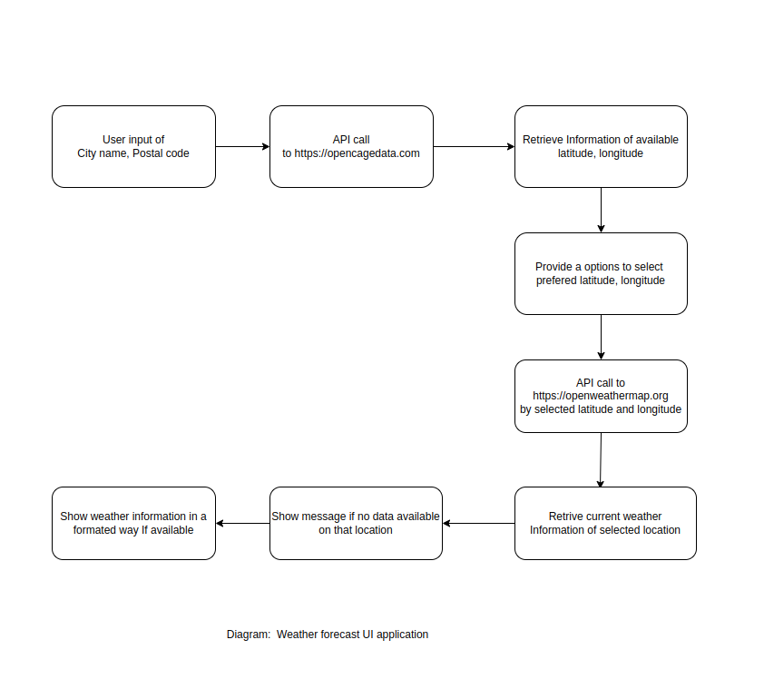
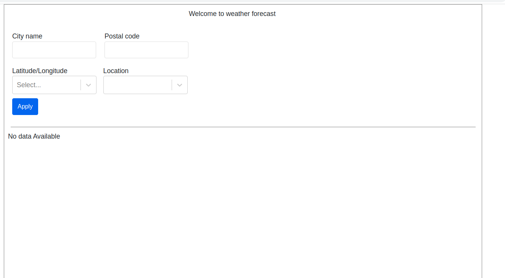
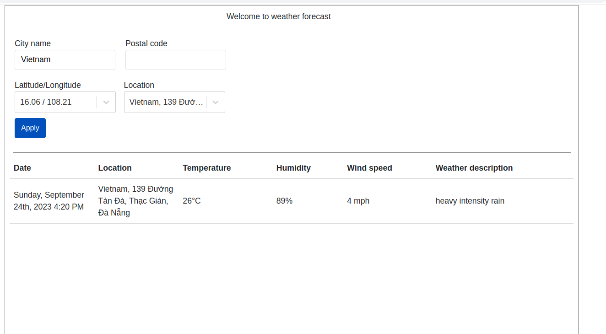
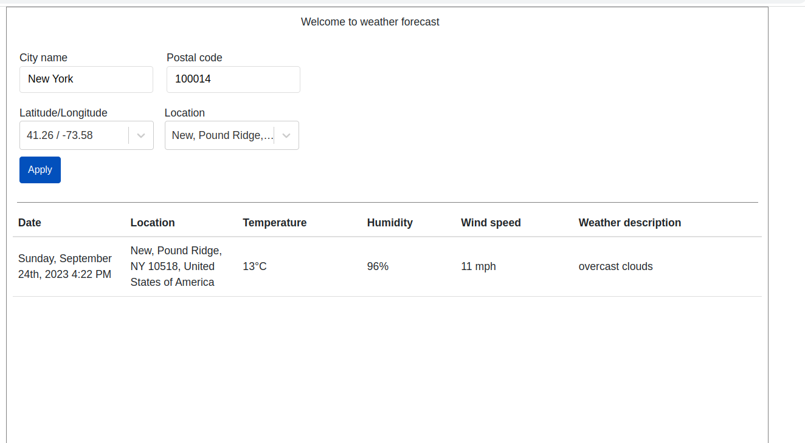

Weather forecast web application by React JS
--------------------------------------------

Linux command to Run Application
--------------------------------
cd to /path/to/weather-forecast-application

```
npm install react-scripts && npm run dev
```

To Run Test
-----------
```
npm test
```

Design Diagram
--------------
-Flow chart


Task breakdown
--------------
Task 1. Design a User Interface where User is able to give input of City name or Postal code which he/she wanted to see current weather information.

Task 2. System will provide a range of options for users to narrow down the locations. By making a
 API call to https://opencagedata.com system will retrieve a list of latitude and longitude.

Task 3. Implement a selection UI where user is able to select his/her prefered location by choosing latitude/longitude.

Task 4. Provide options to show the list of available locations of corresponding latitude/longitude.

Task 5. System will retrieve current weather information metadata by making an API call to https://openweathermap.org by providing selected latitude/longitude.

task 6. Show message if no data available on selected location or input is not correctly provided.

Task 7. Display weather information in human readable format by parsing metadata.

Task 8. Write unit test for functionality.


Application ScreenShot
----------------------
-Initial view
-Search view 1
-Search view 2